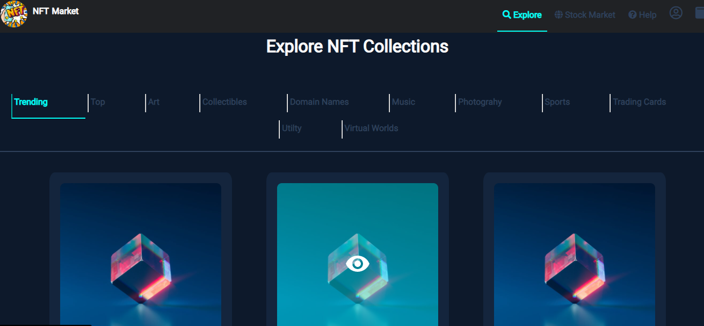
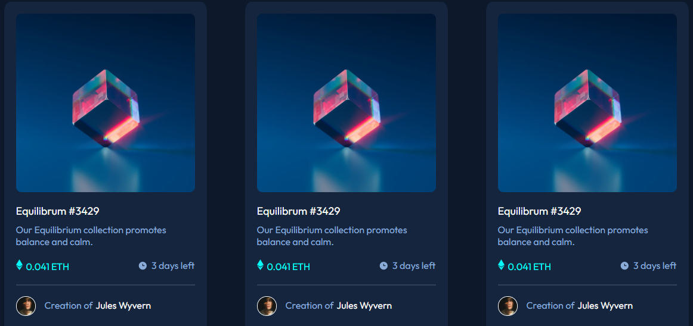

# Frontend Mentor - NFT preview card component solution

This is my beginner solution to the [NFT preview card component challenge on Frontend Mentor](https://www.frontendmentor.io/challenges/nft-preview-card-component-SbdUL_w0U)

## Table of contents

- [Overview](#overview)
  - [The challenge](#the-challenge)
  - [Screenshot](#screenshot)
  - [Links](#links)
- [My process](#my-process)
  - [Built with](#built-with)
  - [What I learned](#what-i-learned)
  - [Continued development](#continued-development)
  - [Useful resources](#useful-resources)
- [Author](#author)

## Overview

### The challenge

Users are able to:

- View the optimal layout depending on their device's screen size
- See hover states for interactive elements

### Screenshot

### Links

- Solution URL: [Link](https://nefario3k.github.io/the-nft-challenge-solution/)
- Live Site URL: [Link](https://nefario3k.github.io/the-nft-challenge-solution/)

## My process

### Built with

- Semantic HTML5 markup
- CSS custom properties

### What I learned

I learnt a lot of new styles with css attribues and properties. I also understood the default display types of different HTML selectors and how to use position styles in css. I was able to work with multiple classes without messing and reusing a class in a wrong html tag. Although my class naming needs more professionalism, I am quite happy I got this hands on experience.

### Continued development

Most of the styles used in styling this website felt really outdated to me as i didnt use any complex css for styles. I had issues with the positioning and I feel like the methods I used for rendering the position styles for the elemments was not very professional and not very responsive enough to various viewports.

### Useful resources

- [Example resource 1](https://css3buttongenerator.com/) - This helped me in styling buttons, made it a lot easier in button styling and creating hover states for each button.

- [Example resource 2](https://www.w3schools.com/) - This is an amazing article which helped me get better understaning on display attributes and properties associated with each display properties. Also helped in getting better styles and for positioning.

- [Example resource 3](https://cssgenerator.org/) - This also assisted me in creating box shadows and learnt a lot about using gradient in button styles.

## Author

- Frontend Mentor - [@Nefario3k](https://www.frontendmentor.io/profile/Nefario3k)
